# SMB Network Infrastructure Lab

A simulated Small-to-Medium Business network environment integrating Cisco networking with Windows Active Directory infrastructure. Built to demonstrate real-world enterprise deployment and troubleshooting workflows.

---

## What Was Built

- VLAN segmentation across 6 departments
- Inter-VLAN routing using router-on-a-stick architecture
- NAT/PAT for internet simulation
- ACL security policies
- DHCP relay across VLANs
- Windows Active Directory with DNS
- Role-Based Access Control (RBAC) with SMB file shares
- Domain authentication and domain join process

---

## Technologies Used

| Tool | Purpose |
|---|---|
| Cisco Packet Tracer | Network simulation |
| Windows Server 2019 | AD DS / DNS / File Services |
| Windows 10 | Client systems |
| Oracle VirtualBox | Virtualization |
| Cisco IOS CLI | Router and switch configuration |

---

## Network Design

**Architecture:** Router-on-a-stick with centralized Windows server infrastructure

| VLAN | Name | Subnet | Purpose |
|---|---|---|---|
| 10 | Management | 192.168.10.0/24 | IT/Admin Devices |
| 20 | Staff | 192.168.20.0/24 | Employee Workstations |
| 30 | Servers | 192.168.30.0/24 | AD/DNS/File Services |
| 40 | Printers | 192.168.40.0/24 | Network Printers |
| 50 | Guest | 192.168.50.0/24 | Guest Wireless |
| 60 | Voice | 192.168.60.0/24 | IP Phones |

---

## Network Screenshots

**SMB Network Layout**
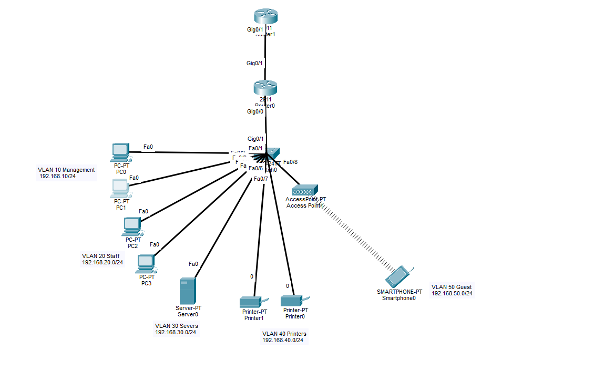

**VLAN Verification**
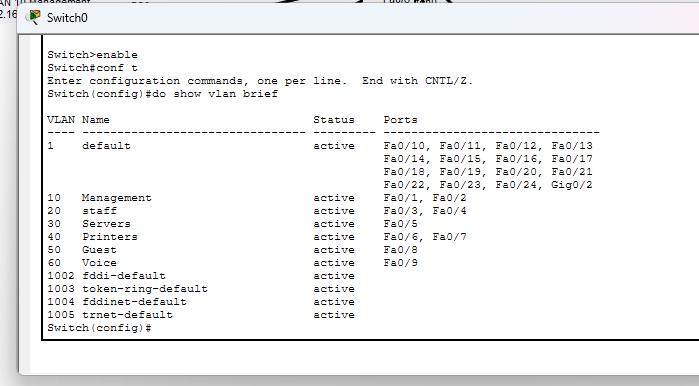

**Trunk Port Configuration**
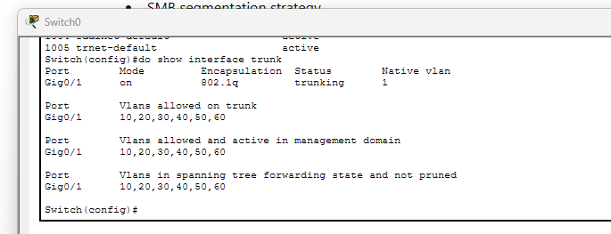

**Router Interface Configuration**

**Router Running Configuration**
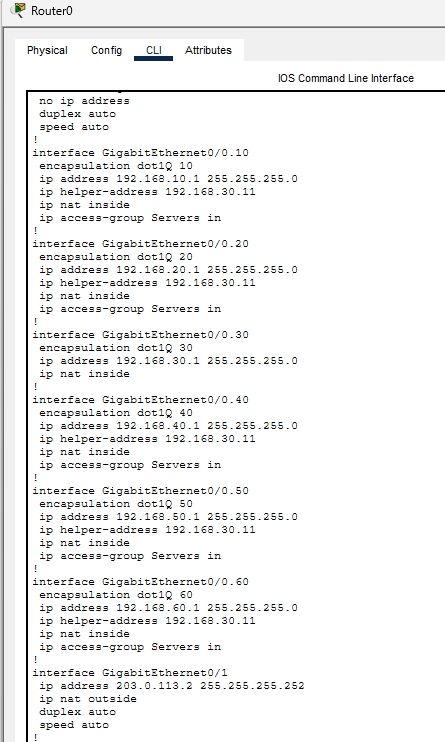

**ACL Configuration**

**NAT Translation Table**
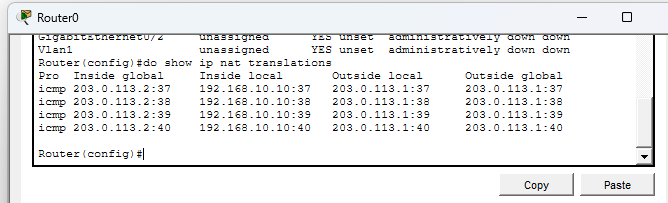

**PAT Configuration**
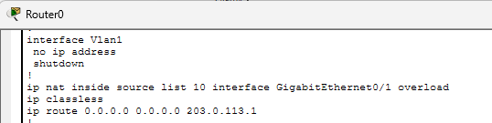

**DHCP Validation — Printers VLAN**

**DHCP Validation — Voice VLAN**
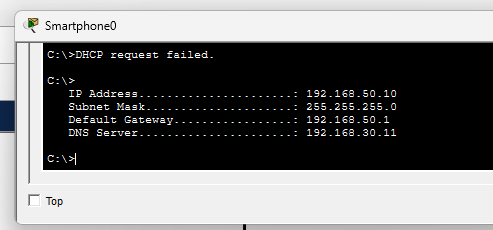

**Connectivity Testing — VLAN 10**
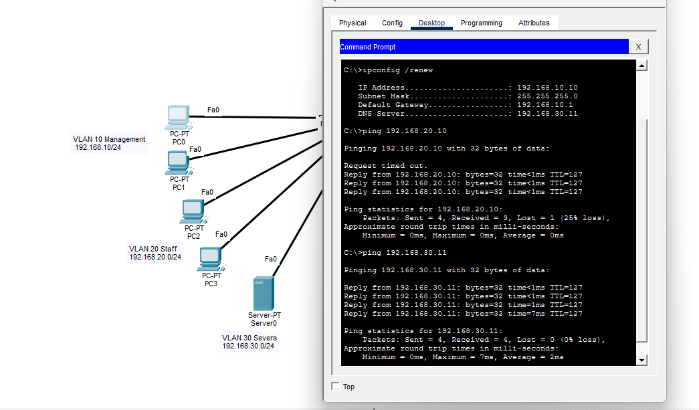

**Connectivity Testing — VLAN 20**
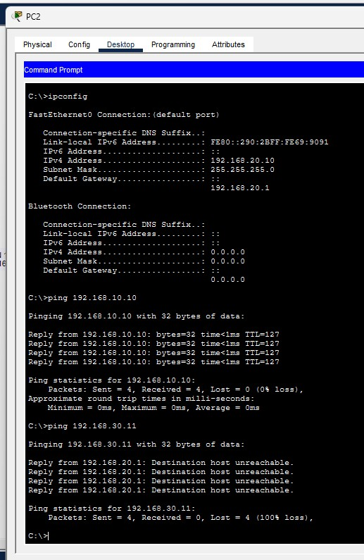

**Printer VLAN Ping Test**
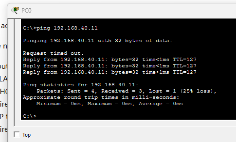

**Guest VLAN Ping Test**
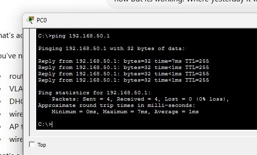

---

## Active Directory Infrastructure

Domain: `corp.local`

Configured services:
- Active Directory Domain Services
- DNS
- Organizational Units (Management, Staff, Users, Groups, Computers)
- Security Groups with RBAC
- SMB file shares with NTFS permissions
- Domain authentication

**AD + DNS Installation**

**Roles and Features**

**DNS Validation**

**PowerShell Domain Setup**

**Management Groups**

**Management Users**

**Staff Groups**

**Staff Users**

**Domain Join**

**Successful Domain Membership**

---

## RBAC and File Share Security

Security groups implemented: `HR_Users` · `Staff_Users` · `Sales_Users` · `IT_Admins`

**HR Share — Authorized Access**

**Management Share — Authorized Access**

**HR User Access Validation**

**Unauthorized Access Denied**

**Elevated IT Admin Permissions**

---

## Skills Demonstrated

**Networking:** VLAN segmentation · Trunking · Router-on-a-stick · ACL implementation · NAT/PAT · DHCP relay · DNS troubleshooting

**Systems Administration:** Active Directory · Organizational Units · Group management · RBAC · SMB file shares · Domain joins

**Troubleshooting:** Connectivity issues · Access control validation · DNS resolution · DHCP relay · Permission conflicts

---

## Lessons Learned

- VLAN segmentation improves both security and network organization
- ACLs require careful planning and layered testing
- DNS is critical for Active Directory functionality — most AD issues trace back to DNS
- File share permissions require both share-level and NTFS permissions to work correctly
- Troubleshooting requires a methodical layered approach across switching, routing, DNS, and authentication

